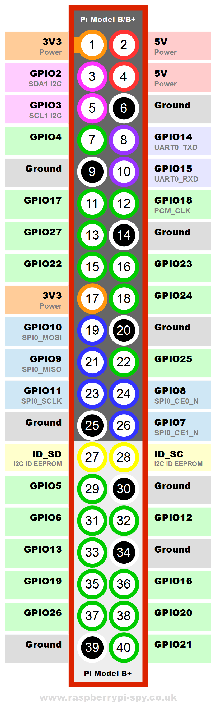

# Part list
[Reference for IR stuff  here](https://www.amazon.fr/Eagles-infrarouge-%C3%A9metteur-r%C3%A9cepteur-VS1838B/dp/B07GPLBXWW/ref=sr_1_12?__mk_fr_FR=%C3%85M%C3%85%C5%BD%C3%95%C3%91&dchild=1&keywords=LED+Diode+Infrarouge&qid=1587315856&sr=8-12)  
[These are the ones I bought](https://www.amazon.fr/gp/product/B00EFOTJZE/ref=ppx_yo_dt_b_asin_title_o09_s00?ie=UTF8&psc=1)  

## IR LED
- Diamètre: 5mm
- longueur d'onde: 940nm
- Puissance: 0.15 W
- Angle de réception: 40 degrés
- Tension (VF): 1.1-1.4 V (0.1 V chaque fichier)
- Longue vague (WD): 940 nm
- Puissance: 0.15 W
- Puissance maximale: 70 mw
- Courant direct maximum: 30 ma;
- Tension inverse maximale: 5 v;
- Crête maximale de courant d'impulsion: 75 ma;
- Température / temps de soudage: 260 / acuités 5S;
- Environnement de travail: - 25 ~ + 70
- Température de stockage: - 25 ~ + 80
- Distance de transmission et de réception: environ 7 - 8 M.

## IR Receiver
- Numéro de modèle: VS1838B;
- Tension de travail: 2.7V à 5.5V
- Distance de la réception: 18M;
- Angle de réception: ± 45 °
- Degré; Basse tension Tension: 0.4V
- Tension de haut niveau: 4,5 V;
- Taille du corps: 7 x 7 x 5 mm / 0,27 "x 0,27" x 0,2 "(L * W * T);
- Longueur de la broche: 22.5mm / 0.88 "
- Pas: 2mm / 0.08 ";

## Raspberry Pi
I used the Raspberry Pi 2 Model B v2 but any Raspberry Pi should work.  

## Resistor
You need 1 resistor between 150ohm to 500ohm.  
I used a 330ohm one.  

## Generic obvious stuff
You need wires or jumper wires, maybe a breadboard, whatever to connect the circuit together.  

# Hardware Installation
I followed [this video](https://www.youtube.com/watch?v=TIbp7DzfOBM) to do my installation.  

## Hooking up the IR LED transmitter
You can use 150ohm to 500ohm and the lower the ohm, the “brighter” the LED will shine and so the  more distance you will be able to have between the emitter and the receiver.  
The 330ohm resistors that I have should be just fine.  
Here it’s for using it with 5V but 3.3V might also work (you’ll have less range if it does).  
The circuit is: rpi ground -> resistor -> cathode of LED (short leg) - then - anode of LED (long leg) -> rpi GPIO.  
You can use any GPIO pin that you want (except GPIO13), I personally used GPIO12.    

## Hooking up the IR receiver
You don’t need any resistors.  
While facing, (the face is the bulb side where you see the LED):  
- Left pin = Signal
- Middle pin = Ground
- Right pin = Power

Voltage has to be between 2.7V and 5.5V for my model.  
“Signal” is what goes to the GPIO pin. You have to use the GPIO13.  

## GPIOs
You must use the GPIO13 for the receiver.  
For the transmitter, you can use any other GPIO pin. You will have to set the GPIO when you create a new device in the API. This ables you to connect several transmitter LEDs if you want to, but you can also use only one and set the same GPIO for every device that you create.  
Here are the pins on the Raspberry Pi:  

